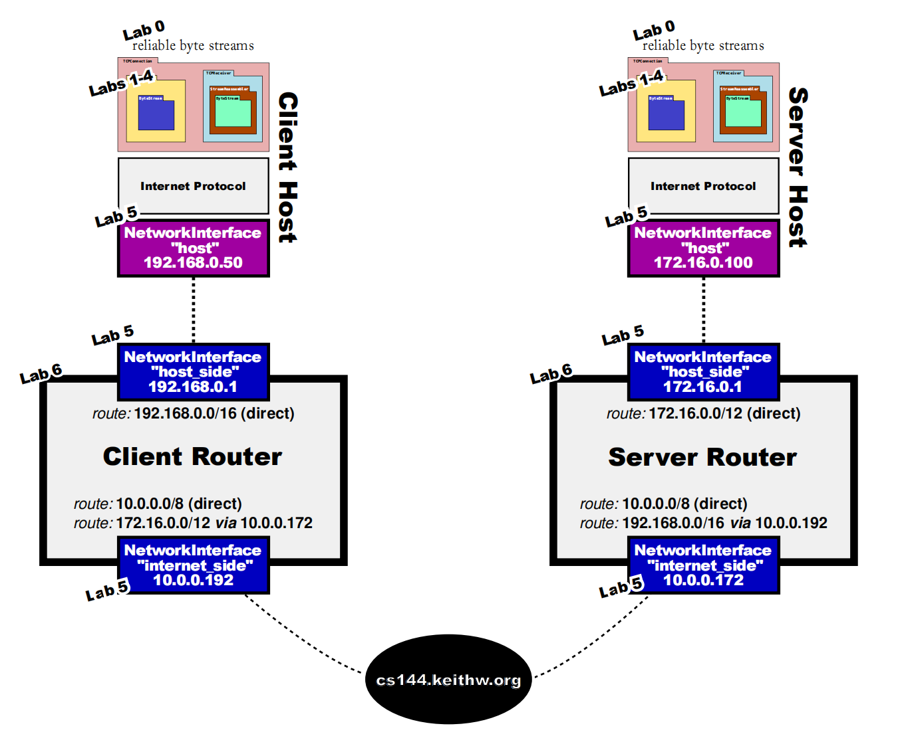

- [x] lab 0: networkikng warmup
- [x] lab 1: stitching substring into a byte stream
- [x] lab 2: the TCP receiver
- [x] lab 3: the TCP sender
- [x] lab 4: the TCP connection
- [x] lab 5: the networking interface
- [x] lab 6: the IP router
- [x] lab 7: putting it all together

完成CS144的全部lab，并通过所有测试。

1. 实现了TCP协议，并成功与外界主机进行通信。
2. 实现ARP协议。
3. 实现简单的路由器。
4. 实现了通外界的可靠通信。

For build prereqs, see [the CS144 VM setup instructions](https://web.stanford.edu/class/cs144/vm_howto).

## Sponge quickstart

To set up your build directory:

	$ mkdir -p <path/to/sponge>/build
	$ cd <path/to/sponge>/build
	$ cmake ..

**Note:** all further commands listed below should be run from the `build` dir.

To build:

    $ make

You can use the `-j` switch to build in parallel, e.g.,

    $ make -j$(nproc)

To test (after building; make sure you've got the [build prereqs](https://web.stanford.edu/class/cs144/vm_howto) installed!)

    $ make check_labN *(replacing N with a checkpoint number)*

The first time you run `make check_lab...`, it will run `sudo` to configure two
[TUN](https://www.kernel.org/doc/Documentation/networking/tuntap.txt) devices for use during
testing.

### build options

You can specify a different compiler when you run cmake:

    $ CC=clang CXX=clang++ cmake ..

You can also specify `CLANG_TIDY=` or `CLANG_FORMAT=` (see "other useful targets", below).

Sponge's build system supports several different build targets. By default, cmake chooses the `Release`
target, which enables the usual optimizations. The `Debug` target enables debugging and reduces the
level of optimization. To choose the `Debug` target:

    $ cmake .. -DCMAKE_BUILD_TYPE=Debug

The following targets are supported:

- `Release` - optimizations
- `Debug` - debug symbols and `-Og`
- `RelASan` - release build with [ASan](https://en.wikipedia.org/wiki/AddressSanitizer) and
  [UBSan](https://developers.redhat.com/blog/2014/10/16/gcc-undefined-behavior-sanitizer-ubsan/)
- `RelTSan` - release build with
  [ThreadSan](https://developer.mozilla.org/en-US/docs/Mozilla/Projects/Thread_Sanitizer)
- `DebugASan` - debug build with ASan and UBSan
- `DebugTSan` - debug build with ThreadSan

Of course, you can combine all of the above, e.g.,

    $ CLANG_TIDY=clang-tidy-6.0 CXX=clang++-6.0 .. -DCMAKE_BUILD_TYPE=Debug

**Note:** if you want to change `CC`, `CXX`, `CLANG_TIDY`, or `CLANG_FORMAT`, you need to remove
`build/CMakeCache.txt` and re-run cmake. (This isn't necessary for `CMAKE_BUILD_TYPE`.)

### other useful targets

To generate documentation (you'll need `doxygen`; output will be in `build/doc/`):

    $ make doc

To format (you'll need `clang-format`):

    $ make format

To see all available targets,

    $ make help
